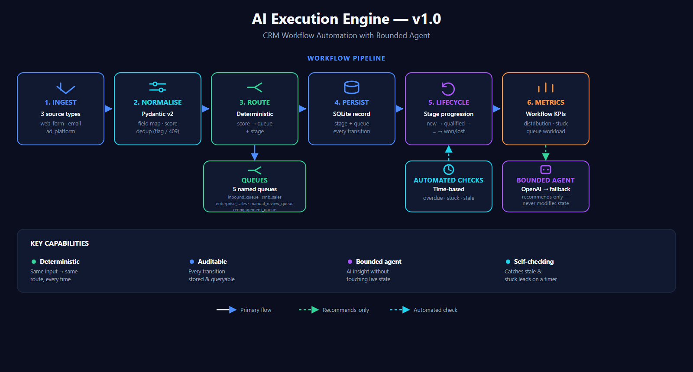

# AI Execution Engine (CRM Workflow Automation) — v1.0

## The Problem With Workflow Automation That Can't See Itself

Lead-handling workflows are easy to start and hard to keep honest.
Leads arrive from different channels in different shapes, get scored
and routed, and move through stages — but most automations handle
intake inconsistently, route on logic that can't be audited, and have
no way to show where leads stall or why. And when an AI is added, it
often acts directly on the workflow, so a bad suggestion becomes a bad
state change with no way back.

This system runs the workflow deterministically and adds an AI layer
that recommends improvements without ever touching the workflow's
state.

## What This System Does

A stateful CRM workflow engine. It ingests leads from three source
types, normalises them into one schema, scores and routes them
deterministically to named queues and stages, persists every state
transition, computes workflow metrics, and exposes a bounded agent
that reads those metrics and recommends changes — without modifying
any CRM state.

**Who this is for:** Operations and sales teams running lead workflows
who need execution to be deterministic and auditable, with AI used for
insight rather than uncontrolled action.

## Why Bound the Agent?

An agent that can change workflow state is an agent that can break it
silently. Here, scoring and routing are deterministic and testable;
the agent reads the resulting state and metrics and proposes changes
for a human to act on. You get AI insight without handing it the
controls — the same separation a careful operator keeps between
analysis and execution.

## Outcome

Built and run end to end on a 75-lead dataset spanning all three
source types (`web_form`, `email`, `ad_platform`).

- 75 leads ingested in a single demo run, zero normalisation failures
  across all three source types
- Every lead scored and routed deterministically — same input, same
  queue and stage, every time
- Full stage history stored and queryable per lead — the complete
  journey of any lead is reconstructable
- Automated checks surface overdue follow-ups, stuck leads, and stale
  new entries
- The bounded agent produces 3–5 structured recommendations per run,
  each with an expected effect and a trade-off, reading metrics only —
  it never modifies CRM state
- All workflow state exposed through 9 API endpoints

## Architecture



## System Flow

1. **Ingest** — raw leads arrive from `web_form`, `email`, or
   `ad_platform`
2. **Normalise** — source-specific field mapping, score computation,
   and deduplication into one unified schema (duplicates flagged, not
   dropped)
3. **Route** — deterministic, score-based assignment to a queue and
   stage: queues `inbound_queue`, `smb_sales`, `enterprise_sales`,
   `manual_review_queue`, `reengagement_queue`
4. **Persist** — a lead record is created in SQLite; stage and queue
   recorded
5. **Lifecycle** — stages progress `new → qualified → assigned →
   contacted → proposal → won/lost`, via API triggers or automated
   time-based checks, with every transition stored
6. **Measure** — the metrics evaluator computes stage breakdown,
   conversion rates, stuck/aging leads, and queue workload
7. **Recommend (bounded agent)** — an OpenAI agent reads the metrics
   and returns structured recommendations with a deterministic
   fallback; it does not modify any CRM state

## Business Value

| Component | What it enables / prevents |
|---|---|
| Pydantic v2 normalisation | Three lead sources handled as one clean, validated schema |
| Deterministic scoring & routing | Reproducible, testable routing — no black-box decisions |
| Named queues + stages | Five queues (`inbound`, `smb_sales`, `enterprise_sales`, `manual_review`, `reengagement`) — clear operational ownership and a defined lifecycle |
| SQLite state + transitions | Full, reconstructable lead journey and audit trail |
| Deduplication | The same lead is flagged, not double-processed |
| Metrics evaluator | Bottlenecks and stuck leads are visible, not guessed at |
| Bounded agent | AI insight without AI touching live state |
| Automated checks | Overdue and stale leads caught without manual triggering |

## API Endpoints

Nine endpoints grouped by function:

| Endpoint | Purpose |
|---|---|
| `GET /health` | Service health check |
| `POST /ingest` | Accept a raw lead and run normalisation → scoring → routing → persistence |
| `GET /leads` | List all leads; filter by stage or queue |
| `GET /leads/{lead_id}` | Return a single lead with full transition history |
| `POST /progress` | Manually advance a lead to a new stage |
| `POST /progress/stage` | Explicit stage update with separate `to_stage` parameter |
| `POST /workflow/run-checks` | Trigger automated time-based checks (overdue, stuck, stale) |
| `GET /stats` | Computed workflow metrics: stage breakdown, conversion rates, queue workload |
| `GET /agent/recommendations` | Bounded agent recommendations from current metrics (read-only) |

See `/docs` on a running instance for the full interactive spec.

## Stack

Python 3.10+ · Pydantic v2 · FastAPI · SQLite (stdlib) ·
OpenAI `gpt-4o-mini` (deterministic fallback if no key) ·
python-dotenv. (See `requirements.txt` for exact versions.)

## Key Design Decisions

**Deterministic core, bounded agent:** Scoring and routing are pure
and testable; the agent only ever recommends. State changes are never
delegated to the model.

**State and transitions, not just current state:** Every transition is
persisted with a trigger and timestamp, so the system can answer "how
did this lead get here," not only "where is it now."

**Deduplication that flags, not blocks:** A suspected duplicate is
surfaced rather than dropped, because a wrong auto-merge is harder to
undo than a flag.

**Automated checks built in:** Time-based checks run without manual
triggering, closing the gap between "works when I run it" and "keeps
working."

**Standalone:** Reuses patterns from the other engines — Pydantic,
deterministic fallback, SQLite audit, controlled agent layer — but
shares no files with them.

## Known Limitations

**Synthetic data** — the 75-lead dataset is generated, not real CRM
data.

**No API authentication** — endpoints are open; production requires
auth middleware.

**SQLite** — does not support concurrent writes at high throughput.
Production upgrade: PostgreSQL.

**Stateless agent** — analysis has no memory of prior recommendations
or cross-run trend tracking; recommendations require manual
implementation.

*Production path: PostgreSQL · external scheduler / task queue ·
API authentication · real CRM integration.*

## Status

Complete — v1.0

## Setup

```bash
# 1. Install dependencies
pip install -r requirements.txt

# 2. Configure environment
cp .env.example .env
# Edit .env and set OPENAI_API_KEY (optional — falls back to deterministic agent if unset)

# 3. Run the demo (seeds the database and prints metrics + recommendations)
python main.py

# Reset the database and re-run from scratch
python main.py --reset

# 4. Start the HTTP API
uvicorn api:app --reload
# Interactive docs available at http://localhost:8000/docs
```

The demo run seeds 75 leads from `data/raw_inputs.json`, runs automated workflow checks,
simulates lifecycle progressions, and prints metrics and agent recommendations to stdout.
To regenerate the dataset: `python data/generate_dataset.py`

## Repository Structure

```
ai-execution-engine/
├── api.py                    # FastAPI app and route definitions
├── main.py                   # Local demo runner and seed entry point (--reset)
├── requirements.txt
├── .env.example
├── ai-execution-engine_architecture.png
│
├── pipeline/
│   ├── normalizer.py         # Source-specific field mapping + score computation
│   ├── router.py             # Deterministic queue and stage assignment
│   ├── workflow_engine.py    # Ingest orchestration and bulk processing
│   ├── state_manager.py      # Stage transitions and automated checks
│   ├── metrics_evaluator.py  # Workflow KPI computation
│   └── agent_analyzer.py     # OpenAI agent with deterministic fallback
│
├── models/
│   └── schemas.py            # Pydantic schemas for all data types
│
├── database/
│   └── db.py                 # SQLite connection, schema init, read/write queries
│
├── config/
│   └── settings.py           # Environment-based configuration
│
├── utils/
│   └── logger.py             # Shared logger
│
└── data/
    ├── raw_inputs.json       # 75 pre-generated leads across 3 source types
    └── generate_dataset.py   # Dataset generation script
```

## System Context

Part of a five-engine AI decision system:

- **[AI Reliability Engine](https://github.com/kobescak-kristian/ai-reliability-engine)** - prevents invalid AI outputs from entering workflows
- **[AI Decision Engine](https://github.com/kobescak-kristian/ai-decision-engine)** - tracks outcomes and evaluates whether decisions were correct
- **[AI Impact Scoring Engine](https://github.com/kobescak-kristian/ai-impact-scoring-engine)** - measures the financial impact of decisions and tunes thresholds
- **AI Execution Engine** - executes the workflow and recommends improvements *(this system)*
- **[AI Context Engine](https://github.com/kobescak-kristian/ai-context-engine)** - grounds decisions in retrieved precedent and explains them

Complete system: validation → evaluation → financial impact → execution → grounded explanation